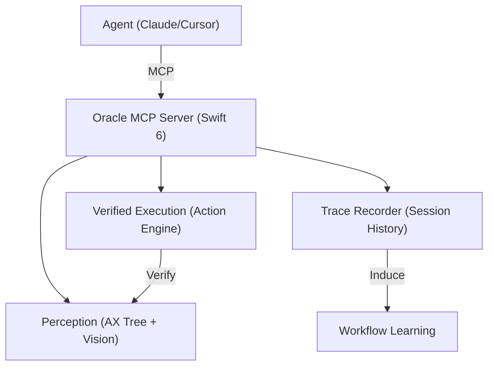

<p align="center">
  
</p>

<h1 align="center">Oracle OS</h1>
<p align="center"><em>The Reliable AI-First Operating Layer for macOS.</em></p>

<p align="center">
  <a href="LICENSE"></a>
  
  
  
  
</p>

---

Oracle OS turns any AI agent into a **reliable computer operator**. By combining the structured macOS accessibility tree with local vision grounding and verified action execution, Oracle gives agents eyes, hands, and a deterministic memory for macOS workflows.

> [!IMPORTANT]
> **Oracle OS is currently in V2.** This version introduces production-grade schemas, Swift 6 Strict Concurrency safety, and trace-driven workflow learning.

## 🔮 The Vision

To move beyond "pixel guessing," Oracle OS implements a multi-layered perception and execution engine:

1.  **Direct Perception**: Reads the macOS Accessibility Tree (AX) for structured, semantic data.
2.  **Visual Grounding**: Uses local vision models (ShowUI-2B) when the AX tree is sparse.
3.  **Verified Execution**: Every action is strictly validated against postconditions (e.g., "did the window actually open?").
4.  **Workflow Learning**: Captures high-fidelity traces to induce robust, replayable recipes.

## 🚀 Key Features

- **Swift 6 Core**: Built on the modern concurrency model for absolute stability and safety.
- **Verified Action Engine**: Uses `ActionVerifier` and `Postconditions` to prevent "hallucinated" clicks.
- **High-Fidelity Tracing**: The `TraceRecorder` logs every state transition, enabling session-based learning.
- **MCP Native**: Plugs directly into Claude Code, Cursor, VS Code, or any MCP client via a clean stdio protocol.
- **Local-First**: Your data and vision models run entirely on your machine.

## 🛠️ Components

| | | |
|:---:|---|---|
| 👀 | **Perception** | Hybrid AX-tree + Vision (ShowUI-2B) for perfect screen understanding. |
| ✅ | **Execution** | Production-grade V2 schema for intents, results, and verifications. |
| 📜 | **Traces** | JSONL session logging for workflow analysis and recipe induction. |
| 📦 | **Recipes** | Replayable, parameterized workflows that skip reasoning for speed. |

## 🕹️ Getting Started

### 1. Install
```bash
git clone https://github.com/dawsonblock/Oracle-OS.git
cd Oracle-OS
swift build
```

### 2. Setup
Run the interactive setup wizard to configure permissions and download the vision sidecar:
```bash
./.build/debug/ghost setup
```

### 3. Verify
Check your system health and permissions:
```bash
./.build/debug/ghost doctor
./.build/debug/ghost status
```

## 🏗️ Architecture



## 📚 Tools (22)

Oracle exposes a rich set of tools for agents to navigate macOS:

- `ghost_context`: Full screen/app semantic state.
- `ghost_click`: Verified element interaction.
- `ghost_ground`: Visual coordinate discovery.
- `ghost_recipes`: Manage and run replayable workflows.
- *...and 18 more specialized tools.*

## 📜 License

MIT - See [LICENSE](LICENSE) for details.

---

*Oracle OS: Built for the age of agentic compute.*
