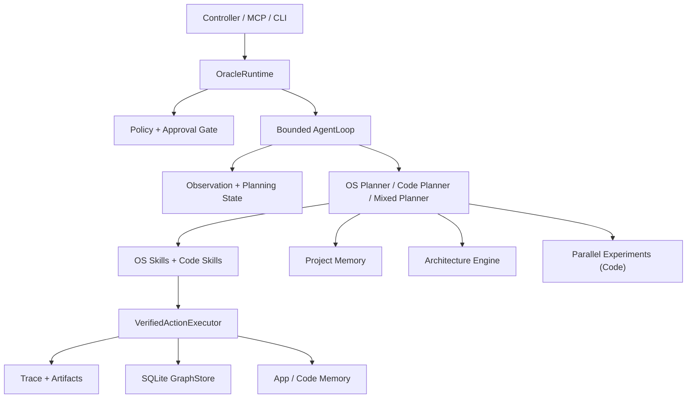

# Oracle OS

Oracle OS is a safe local macOS operator runtime with a shared dual-agent substrate:

- `macOS Operator Agent`: app, browser, window, and file workflow control
- `Software Engineer Agent`: workspace-scoped code reading, editing, building, testing, and git work

Both agents run on the same core path:

`surface (controller / MCP / CLI) -> OracleRuntime -> Policy -> VerifiedActionExecutor -> Trace -> Graph / Memory`

The current repo is no longer just an MCP tool server. It now contains a real verified execution layer, planning-state abstraction, persistent graph learning, a bounded graph-aware loop, a workspace-scoped code runner, and higher-level engineering layers for project memory, parallel experiments, and advisory architecture analysis.

## Current Status

- 22 MCP tools are exposed and remain stable under the `ghost_*` names.
- The native local controller and bundled host process are working.
- Verified execution is active for core interaction actions with pre/post observations, postcondition checks, failure classification, trace output, and graph updates.
- Observation fusion is real: AX remains primary, Chrome CDP is fused conservatively, and vision grounding is available.
- The runtime now supports both OS-domain and code-domain tasks on one shared loop.
- Graph persistence is SQLite-backed.
- Project memory, experiment fanout, and architecture review are implemented as bounded layers above the runtime.
- `ghost_parse_screen` is still experimental.

See [STATUS.md](STATUS.md), [ARCHITECTURE_STATUS.md](ARCHITECTURE_STATUS.md), and [docs/progress.md](docs/progress.md) for lower-level implementation status.

## What Exists Today



## Safe Defaults

Oracle OS is intentionally conservative:

- default policy mode: `confirm-risky`
- risky actions require per-action approval
- controller is the only approval UI
- Terminal/iTerm style UI control is blocked by default
- code execution is workspace-scoped and uses a direct process runner, not Terminal UI automation
- arbitrary shell strings are blocked
- remote or destructive git actions require approval or stay blocked
- experiment candidates do not promote directly into stable graph knowledge

When policy state is ambiguous, the runtime fails closed.

## Core Runtime Layers

### 1. Observation and State

- `ObservationBuilder` and `ObservationFusion` produce canonical runtime observations.
- `StateAbstraction` maps raw observations into reusable planning states.
- Observation hashes remain for exact replay/debug, not as the main planning node.

### 2. Verified Execution

`VerifiedActionExecutor` is still the trust boundary. It performs:

- pre-observation capture
- planning-state abstraction
- raw action execution
- post-observation capture
- postcondition verification
- failure classification
- semantic transition emission
- trace + artifact recording

### 3. Graph Learning

The runtime now records transitions into a SQLite-backed graph with trust separation:

- `candidate`
- `stable`
- `experiment`
- `recovery`
- `exploration`

Promotion and demotion rules are explicit, and experiment/recovery evidence does not promote directly to stable control knowledge.

### 4. Shared Dual-Agent Runtime

The same runtime now supports:

- OS planning and ranked UI interaction
- code planning, repository indexing, workspace-safe editing, build/test loops, and git flows
- mixed tasks that hand off between OS and code phases in one bounded loop

## Project-Carrying Engineering Layer

Three bounded systems now sit above the shared runtime for code work:

### Project Memory

Repo-local canonical Markdown lives under [ProjectMemory](ProjectMemory):

- `architecture-decisions/`
- `open-problems/`
- `rejected-approaches/`
- `known-good-patterns/`
- `risk-register.md`
- `roadmap-state.md`

These records are indexed into SQLite for retrieval, but Markdown is canonical. The runtime only writes draft records.

### Parallel Experiments

Code tasks can fan out into bounded candidate experiments:

- default fanout: 3 candidates
- isolation: git worktrees under `.oracle/experiments/`
- candidate ranking: pass/fail, touched files, diff size, architecture risk, latency
- selected winner is replayed through the main runtime before it becomes normal candidate knowledge

### Architecture Engine

The architecture layer is advisory-first. It analyzes:

- module boundaries
- dependency cycles
- responsibility drift
- boundary violations
- refactor candidates

It emits findings and refactor proposals but does not bypass policy or execution authority.

## Controller

Oracle OS includes a native local controller:

- `OracleController`
- `OracleControllerHost`
- `OracleController.xcworkspace`

The controller is still local-only and supervised. It now surfaces:

- operator control
- recipe execution
- trace/session inspection
- approvals
- code-domain step metadata
- experiment metadata
- project-memory references
- architecture findings

Open it with:

```bash
swift build
open OracleController.xcworkspace
```

See [docs/oracle-controller.md](docs/oracle-controller.md).

## MCP Tool Surface

Oracle OS exposes 22 public tools:

- Perception: `ghost_context`, `ghost_state`, `ghost_find`, `ghost_read`, `ghost_inspect`, `ghost_element_at`, `ghost_screenshot`
- Actions: `ghost_click`, `ghost_type`, `ghost_press`, `ghost_hotkey`, `ghost_scroll`, `ghost_focus`, `ghost_window`
- Vision: `ghost_ground`, `ghost_parse_screen`
- Wait/setup/doctor: `ghost_wait`, `ghost_permissions`, `ghost_doctor`
- Recipes: `ghost_recipes`, `ghost_run`, `ghost_recipe_show`, `ghost_recipe_save`, `ghost_recipe_delete`

The public tool names remain stable even while the internal runtime grows.

## Install

```bash
git clone https://github.com/dawsonblock/Oracle-OS.git
cd Oracle-OS
swift build
```

## Setup

```bash
./.build/debug/oracle setup
./.build/debug/oracle doctor
./.build/debug/oracle status
./.build/debug/oracle version
```

## What Is Still Partial

This repo is much stronger than scaffold-only, but it is not finished:

- `ghost_parse_screen` remains experimental
- architecture reasoning is advisory-first, not autonomous refactor control
- project-memory writes are draft-only
- experiment search is bounded and code-only
- workflow synthesis is deferred
- neural policies, belief state, OpenFst, and distributed execution are deferred

The current ceiling is: a strong local operator runtime plus a bounded coding agent with persistent project memory, experiment search, and architecture review. It is not yet a fully autonomous long-horizon engineering system.

## Development Direction

The next meaningful gains are not more scaffolding. They are:

1. make graph-backed planning and recovery deeper in production paths
2. harden project-memory promotion and review workflows
3. expand experiment selection and replay discipline
4. strengthen architecture findings into controlled refactor governance
5. improve eval coverage for repeated OS and engineering tasks
