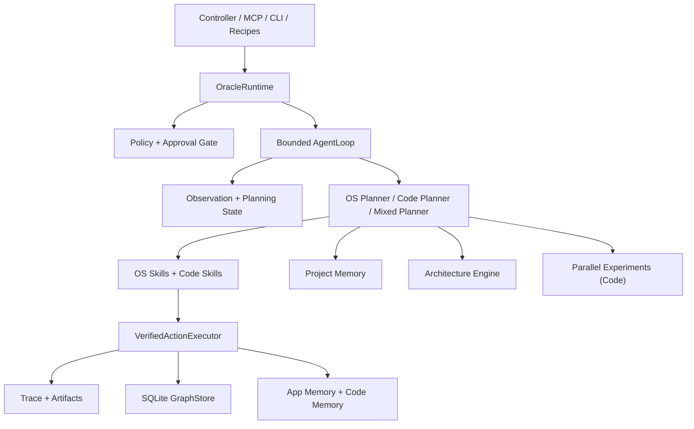

# Oracle OS

Oracle OS is a safe local macOS operator runtime with a shared dual-agent substrate.

It is designed to do two kinds of work on top of the same execution core:

- `macOS Operator Agent`: controls apps, browser flows, windows, files, and supervised UI workflows
- `Software Engineer Agent`: reads code, edits files, runs builds and tests, applies patches, and performs safe local git operations inside the current workspace

Both agents share the same trust boundary:

`surface (Controller / MCP / CLI) -> OracleRuntime -> Policy -> VerifiedActionExecutor -> Trace -> Graph / Memory`

This repository is no longer just a tool surface for MCP clients. It now contains:

- real verified execution with pre/post observation checks
- planning-state abstraction over raw observations
- SQLite-backed graph learning with trust tiers
- a bounded graph-aware runtime loop
- workspace-scoped code execution
- a native local controller
- long-horizon project memory
- bounded parallel code experiments
- advisory architecture analysis

Oracle OS is already a serious operator substrate. It is not yet a fully autonomous long-horizon digital engineer.

## What Oracle OS Does Today

### macOS operator capabilities

- inspect UI state through AX-first perception
- capture screenshots and element context
- click, type, press, focus, scroll, and window-manage through verified action paths
- run replayable recipes
- enforce policy and approval gating before risky actions
- record trace and artifact evidence for runtime steps

### software engineering capabilities

- index the current workspace
- retrieve repository structure, symbols, dependencies, and tests
- perform workspace-scoped file edits
- run build, test, lint, and formatter commands through a direct process runner
- perform safe local git operations
- keep code execution out of Terminal/iTerm UI automation
- use bounded candidate experiments for code fixes
- retrieve project memory before planning code changes

### shared capabilities

- one runtime
- one policy engine
- one verified execution boundary
- one trace system
- one graph knowledge store
- one memory substrate
- one bounded loop

## Current State

### Working

- 22 public MCP tools remain available under stable `ghost_*` names
- native local controller and bundled host process are working
- verified execution is active for the core interaction actions
- canonical observation snapshots are real and used by runtime logic
- planning-state abstraction is implemented and used as reusable graph state
- graph persistence is SQLite-backed
- policy and approval gating are active runtime concerns, not just scaffolding
- code-domain execution uses a workspace-scoped runner instead of unsafe shell UI control
- project memory, experiment fanout, and architecture review are implemented as bounded upper layers

### Partial

- `ghost_parse_screen` remains experimental
- observation fusion is conservative rather than a full world-model fusion stack
- architecture reasoning is advisory-first, not autonomous refactor governance
- project-memory writes are draft-only
- experiment search is bounded and code-only
- workflow synthesis is deferred

### Not Done

- full autonomous long-horizon project execution
- autonomous refactor control with enforced architectural governance
- workflow synthesis and promotion from traces
- belief-state reasoning
- neural policies
- OpenFst planning
- distributed execution

For lower-level implementation status, see [STATUS.md](STATUS.md), [ARCHITECTURE_STATUS.md](ARCHITECTURE_STATUS.md), and [docs/progress.md](docs/progress.md).

## Why This Architecture Exists

The main design constraint is safety plus reuse.

Oracle OS does not want to plan directly over raw screenshots, uncontrolled shell commands, or unverifiable actions. The runtime instead pushes work through these layers:

1. observe the world
2. abstract the observation into reusable planning state
3. choose an action through planners and skills
4. gate the action through policy
5. execute through verified execution
6. record trace evidence
7. update graph and memory only from trusted outcomes

That makes the system slower to overclaim and harder to poison with weak evidence.

## System Overview



## Safety Model

Oracle OS is intentionally conservative.

### Default policy

- policy mode defaults to `confirm-risky`
- risky actions require per-action approval
- controller is the only approval UI
- ambiguous policy state fails closed

### Blocked by default

- Terminal / iTerm / shell-style UI control
- arbitrary shell strings
- writes outside the active workspace root for code tasks
- destructive VCS operations such as force push
- system file mutation through the coding agent

### Allowed without approval

- low-risk observation and inspection
- safe UI focus/navigation in non-protected contexts
- workspace-scoped repository reads
- local build/test/lint/format commands
- safe local git operations such as `status`, `diff`, `branch`, and local `commit`

### Approval-gated examples

- send / submit flows
- purchase / payment style interactions
- destructive file operations
- remote git actions such as `push`
- code changes to sensitive config or release paths when policy rules escalate them

## Core Runtime Layers

### 1. Observation and Planning State

### Observation

`ObservationBuilder` and `ObservationFusion` produce canonical runtime observations.

Current behavior:

- AX remains the primary source
- Chrome CDP enrichment is fused conservatively
- vision grounding exists, but is not yet the dominant fused source
- raw observation hashes are preserved for replay/debug

### Planning state

`StateAbstraction` reduces observations into reusable planning state instead of planning directly over raw UI trees or screenshots.

This matters because:

- small DOM drift should not explode state cardinality
- graph edges need reusable node identity
- code tasks and UI tasks both benefit from stable state abstraction

### 2. Verified Execution

`VerifiedActionExecutor` remains the core trust boundary.

Each verified step can include:

- pre-observation capture
- observation hashing
- planning-state abstraction
- raw action execution
- post-observation capture
- postcondition verification
- failure classification
- semantic transition emission
- trace and artifact recording

The executor is intentionally not the planner, not the policy layer, and not the architecture engine. It is the execution truth boundary.

### 3. Graph Learning

The runtime records transitions into a SQLite-backed graph.

### Knowledge tiers

- `exploration`
- `candidate`
- `stable`
- `experiment`
- `recovery`

Only trusted evidence is allowed to promote into stable control knowledge.

Important rules:

- experiment evidence does not promote directly to stable
- recovery evidence does not promote directly to stable
- blocked or unapproved actions are trace-only
- stable edges are promoted and demoted by explicit policy

This keeps the graph from turning into a bag of anecdotes.

### 4. Shared Dual-Agent Runtime

Oracle OS now runs two domains on one substrate.

### OS-domain planning

- graph-backed UI interaction
- ranked target resolution
- policy-checked action dispatch
- verified UI execution
- trace-driven recovery hooks

### code-domain planning

- repository indexing
- target file/query selection
- bounded patch / build / test loops
- safe workspace execution
- graph-aware reuse of previously successful patterns

### mixed tasks

Mixed tasks hand off between domains in one bounded loop instead of spinning up separate runtimes.

Examples:

- open repo in Finder, then run tests
- inspect app state, then patch code based on a local project
- complete a local engineering workflow that includes UI and code steps

## Project-Carrying Engineering Layer

Three bounded systems now sit above the shared runtime for code work.

### 1. Project Memory

Project memory is engineering memory, not chat memory.

Canonical Markdown lives under [ProjectMemory](ProjectMemory):

- `architecture-decisions/`
- `open-problems/`
- `rejected-approaches/`
- `known-good-patterns/`
- `risk-register.md`
- `roadmap-state.md`

The Markdown files are canonical and human-reviewable. A derived SQLite index exists only for retrieval speed.

### What project memory stores

- architecture decisions
- unresolved problems
- rejected approaches
- known-good patterns
- current risks
- roadmap state

### What it enables

- retrieving prior design constraints before edits
- avoiding already-failed approaches
- preserving architectural continuity across sessions
- keeping unresolved work visible instead of silently forgotten

The runtime writes draft records only. Promotion to accepted engineering memory is deliberately separate.

### 2. Parallel Experiments

Code tasks can fan out into bounded candidate experiments.

### Current design

- default fanout: 3 candidates
- isolation mechanism: git worktrees
- experiment root: `.oracle/experiments/`
- ranking order:
  1. passing build/tests
  2. fewer touched files
  3. smaller diff
  4. lower architecture risk
  5. lower latency

### Important trust rule

Only the selected candidate, replayed and verified in the primary workspace, can become normal candidate graph knowledge.

Non-selected experiment runs remain traceable evidence, not promotable control knowledge.

### 3. Architecture Engine

The architecture layer is advisory-first in the current repo.

### It analyzes

- module boundaries
- dependency cycles
- responsibility drift
- planner / executor boundary violations
- policy / execution boundary violations
- skill / ranking boundary violations
- refactor opportunities

### It emits

- architecture findings
- invariant violations
- refactor proposals
- risk scores used by experiment ranking

What it does **not** do yet:

- auto-refactor the codebase
- override policy
- bypass verified execution
- autonomously rewrite architecture boundaries

## Controller

Oracle OS includes a native local controller:

- `OracleController`
- `OracleControllerHost`
- `OracleController.xcworkspace`

The controller is local-only and supervised.

### What it surfaces today

- operator control
- recipe execution
- trace/session inspection
- policy approvals
- code-domain step metadata
- build/test summaries
- patch IDs
- experiment metadata
- project-memory references
- architecture findings

Open it with:

```bash
swift build
open OracleController.xcworkspace
```

More details: [docs/oracle-controller.md](docs/oracle-controller.md)

## MCP Tool Surface

Oracle OS currently exposes 22 public MCP tools:

### Perception

- `ghost_context`
- `ghost_state`
- `ghost_find`
- `ghost_read`
- `ghost_inspect`
- `ghost_element_at`
- `ghost_screenshot`

### Actions

- `ghost_click`
- `ghost_type`
- `ghost_press`
- `ghost_hotkey`
- `ghost_scroll`
- `ghost_focus`
- `ghost_window`

### Vision

- `ghost_ground`
- `ghost_parse_screen`

### Wait / setup / diagnostics

- `ghost_wait`
- `ghost_permissions`
- `ghost_doctor`

### Recipes

- `ghost_recipes`
- `ghost_run`
- `ghost_recipe_show`
- `ghost_recipe_save`
- `ghost_recipe_delete`

The public tool names remain stable even while the internal runtime evolves.

## Repository Layout

High-value parts of the repo are organized around the runtime, not around prompts:

```text
ProjectMemory/                  canonical project memory
Sources/OracleOS/
  Runtime/                      runtime spine, loop, routing, task context
  Core/
    Observation/                canonical observations and fusion
    PlanningState/              reusable planning state abstraction
    Execution/                  verified execution boundary
    ExecutionSemantics/         action contracts and verified transitions
    Policy/                     gating and approvals
    Ranking/                    ranked target resolution
    Trace/                      structured traces and artifacts
    World/                      shared world view
  Graph/                        candidate/stable graph + SQLite persistence
  CodeExecution/                workspace-scoped command runner
  CodeIntelligence/             repository indexing and structural queries
  Experiments/                  git worktree experiment fanout
  Architecture/                 advisory architecture analysis
  ProjectMemory/                runtime-facing project-memory index/query/store
  Agent/
    Planning/                   OS/code/mixed planning
    Skills/                     OS skills and code skills
    Recovery/                   runtime and code recovery logic
  Learning/Memory/              lightweight bias memory
  MCP/                          MCP surface
Sources/OracleController/       native local controller UI
Sources/OracleControllerHost/   local host process for controller
Tests/OracleOSTests/            unit/runtime contract tests
Tests/OracleOSEvals/            repeated task eval harness
```

## Install

```bash
git clone https://github.com/dawsonblock/Oracle-OS.git
cd Oracle-OS
swift build
```

## Setup

```bash
./.build/debug/oracle setup
./.build/debug/oracle doctor
./.build/debug/oracle status
./.build/debug/oracle version
```

## Development Commands

```bash
swift build
swift test
open OracleController.xcworkspace
```

## How Code Tasks Execute

The code-domain path is intentionally not a terminal-driving agent.

Current shape:

1. classify the goal as code-domain or mixed
2. index the current workspace
3. retrieve relevant project-memory records
4. run architecture review if the change looks high-impact
5. choose a direct step or escalate to bounded experiments
6. execute through the workspace-scoped runner
7. replay the selected winner through the primary runtime path
8. record trace, graph, and memory updates

This keeps code execution local, inspectable, and bounded.

## How macOS Tasks Execute

The OS-domain path looks like:

1. observe the frontmost app and UI state
2. abstract the state
3. query graph-backed or exploration-backed planner output
4. resolve targets through ranking
5. gate the action through policy
6. execute through verified execution
7. classify success/failure
8. record trace and update graph/memory

This is the path that makes Mac control safer than raw automation scripts.

## Current Limits

Oracle OS is stronger than architecture-only scaffolding, but several things are still intentionally incomplete:

- `ghost_parse_screen` is experimental
- vision is not yet the dominant fused perception path
- project-memory writes are drafts, not accepted records
- architecture findings are advisory-first
- experiments are bounded and code-only
- workflow synthesis is deferred
- recovery is meaningful but still not a fully matured autonomous repair system
- the system is not yet a persistent fully autonomous digital engineer

## What Oracle OS Is Becoming

The current repo is on the path from:

`safe local operator + bounded coding agent`

toward:

`project-carrying engineering runtime`

That next stage requires more than adding models or bigger planners. The real gains still come from:

1. better graph-backed planning and recovery
2. stronger trust-tier promotion discipline
3. better project-memory promotion and review workflows
4. better experiment replay and selection
5. stronger architecture governance
6. broader and harsher eval coverage

## Summary

Oracle OS today is best understood as:

> a safe local macOS operator runtime with a shared OS + code substrate, verified execution, planning-state abstraction, trace semantics, SQLite-backed graph learning, project memory, bounded code experiments, and advisory architecture reasoning

That is already far beyond a prompt wrapper or a thin MCP server.

It is also still intentionally bounded.
