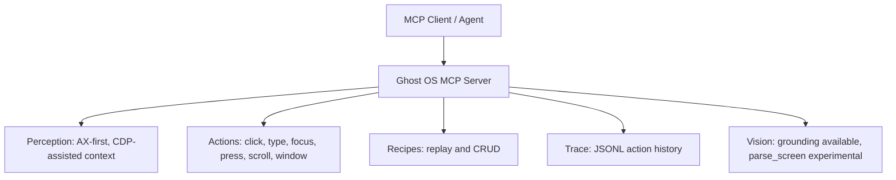

# Ghost OS

Ghost OS is a macOS computer-use runtime for MCP agents. It exposes a stable 22-tool surface for perception, action, screenshots, recipes, and setup workflows, while the operator-runtime work continues underneath that surface.

## Current Status

- 22 MCP tools are exposed by the Swift server.
- AX-first perception is working for `ghost_context`, `ghost_state`, `ghost_find`, `ghost_read`, `ghost_inspect`, `ghost_element_at`, and `ghost_screenshot`.
- Verified execution is wired for `ghost_click`, `ghost_type`, `ghost_press`, and `ghost_focus` with pre/post observations, postcondition checks, and JSONL trace output.
- Recipes are replayable JSON workflows. They are not self-learning yet.
- `ghost_ground` works through the vision sidecar.
- `ghost_parse_screen` is wired to the vision sidecar, but it should still be treated as experimental until the output contract and reliability are hardened.

See [STATUS.md](/Users/dawsonblock/Downloads/ghost-os-main/STATUS.md) and [ARCHITECTURE_STATUS.md](/Users/dawsonblock/Downloads/ghost-os-main/ARCHITECTURE_STATUS.md) for the current implementation boundary.

## What Exists Today



This repository is moving toward a more complete operator runtime with fused observation, verified execution, recovery, and learning. That broader architecture is scaffolded, not finished.

## Install

```bash
git clone https://github.com/dawsonblock/ghost-os.git
cd ghost-os
swift build
```

## Setup

```bash
./.build/debug/ghost setup
./.build/debug/ghost doctor
./.build/debug/ghost status
./.build/debug/ghost version
```

The runtime version and sidecar version are currently aligned at `2.0.6`.

## Tool Surface

Ghost OS exposes 22 tools:

- Perception: `ghost_context`, `ghost_state`, `ghost_find`, `ghost_read`, `ghost_inspect`, `ghost_element_at`, `ghost_screenshot`
- Actions: `ghost_click`, `ghost_type`, `ghost_press`, `ghost_hotkey`, `ghost_scroll`, `ghost_focus`, `ghost_window`
- Vision: `ghost_ground`, `ghost_parse_screen`
- Wait/setup/doctor: `ghost_wait`, `ghost_permissions`, `ghost_doctor`
- Recipes: `ghost_recipes`, `ghost_run`, `ghost_recipe_show`, `ghost_recipe_save`, `ghost_recipe_delete`

The public tool names are stable even where implementation depth is not.

## Truth Pass Notes

- Package identity remains `GhostOS`; this repo has not been renamed.
- Recipe messaging is intentionally limited to replay and manual or agent-authored saves.
- Full-screen `/detect` and `/parse` support in the vision sidecar exists, but it is still treated as experimental/partial at the Ghost runtime layer.
- New `Core/` and `Agent/` modules are being added incrementally alongside the existing package structure.

## Development Direction

The next bounded milestone is the substrate:

1. Canonical fused observation
2. Verified action execution for core tools
3. Trace-driven diagnostics

Recovery, planning, policy, operational memory, and recipe induction are scaffolded for later milestones, not complete today.
