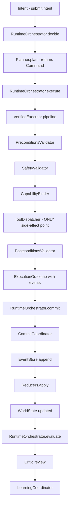

# Oracle-OS Runtime Hardening — Implementation Checklist

## Current State Assessment

### What's Already Built (New Architecture Scaffolding)

| Module | Files | Status |
|--------|-------|--------|
| **API** | `IntentAPI.swift`, `IntentRequest.swift`, `IntentResponse.swift`, `RuntimeSnapshot.swift` | ✅ Complete |
| **Commands** | `Command.swift`, `CommandRouter.swift`, `UICommand.swift`, `CodeCommand.swift`, `SystemCommand.swift` | ✅ Complete |
| **Events** | `EventStore.swift`, `EventEnvelope.swift`, `EventReducer.swift`, `CommitCoordinator.swift`, all typed events | ✅ Complete |
| **Execution** | `VerifiedExecutor.swift`, `ExecutionOutcome.swift`, `PreconditionsValidator.swift`, `SafetyValidator.swift`, `PostconditionsValidator.swift`, `ToolDispatcher.swift`, `CapabilityBinder.swift`, `Artifact.swift` | ✅ Scaffolded |
| **State** | `StateSnapshot.swift`, `StateReducer.swift`, `RuntimeStateReducer.swift`, `UIStateReducer.swift`, `ProjectStateReducer.swift`, `MemoryStateReducer.swift`, `SnapshotStore.swift`, `StateStore.swift` | ✅ Scaffolded |
| **Memory** | `EventMemory.swift`, `SemanticMemory.swift`, `ProjectMemory.swift` | ✅ Stubs |
| **Observability** | `ActionTrace.swift`, `DecisionTrace.swift`, `ExecutionTrace.swift`, `PlanTrace.swift`, `TimelineBuilder.swift`, `EventReplay.swift` | ✅ Stubs |
| **Evaluation** | `Critic.swift` protocol + `CriticReport` | ✅ Stub |
| **Intent** | `Intent.swift`, `IntentDomain.swift`, `IntentNormalizer.swift`, `IntentPriority.swift` | ✅ Created |
| **Code/Repository** | `FileScanner.swift`, `LanguageClassifier.swift`, `SymbolExtractor.swift`, `ReferenceGraphBuilder.swift`, `TestMapBuilder.swift` | ✅ Stubs |
| **AX Scanner Split** | `AXNodeScanner.swift`, `AXWindowScanner.swift`, `AXTreeNormalizer.swift`, `AXActionabilityClassifier.swift`, `UIWorldProjector.swift` | ✅ Stubs |
| **Governance Tests** | `ExecutionBoundaryTests.swift`, `StateMutationTests.swift`, `ControllerBoundaryTests.swift`, `PlannerBoundaryTests.swift`, `LayerImportRulesTests.swift`, `EventHistoryInvariantTests.swift` | ⚠️ Mostly stubs |
| **RuntimeOrchestrator** | Refactored to `decide`/`execute`/`commit`/`evaluate`, conforms to `IntentAPI` | ⚠️ Duplicates executor |

### Critical Gaps (Legacy Systems Still Active)

| Problem | File | Size | Issue |
|---------|------|------|-------|
| **AgentLoop** still uses old architecture | `Execution/Loop/AgentLoop.swift` | 3.9KB + `AgentLoop+Run.swift` 15KB | References `MainPlanner`, `GraphStore`, `WorldStateModel` directly |
| **RuntimeExecutionDriver** executes directly | `Runtime/RuntimeExecutionDriver.swift` | 2.5KB | Calls `runtime.performAction()` and `CodeActionGateway` |
| **CodeActionGateway** bypasses executor | `Runtime/CodeActionGateway.swift` | 8KB | Direct filesystem/process execution outside VerifiedExecutor |
| **Actions.swift** mega-file | `Intent/Actions/Actions.swift` | 49KB | Mixes schemas, handlers, and artifact types |
| **AXScanner** monolith | `WorldModel/Perception/AX/AXScanner.swift` | 42KB | Not delegating to new split files |
| **MainPlanner** god object | `Planning/MainPlanner.swift` | unknown | Not yet route-only façade |
| **ControllerRuntimeBridge** deep coupling | `OracleControllerHost/ControllerRuntimeBridge.swift` | 38KB | Likely accesses runtime internals |
| **Legacy memory systems** | `Learning/Memory/*`, `Learning/Project/*` | ~50KB total | Shadow state systems |
| **RuntimeOrchestrator** duplicated pipeline | `Runtime/RuntimeOrchestrator.swift` | 8.9KB | Contains full execution pipeline instead of delegating to VerifiedExecutor |

---

## Target Execution Spine



---

## Wave 1 — Runtime Truth

### 1A. Fix Build Compilation

**Goal**: All new files compile without errors.

**Files to fix**:
- `Sources/OracleOS/Execution/CapabilityBinder.swift` — change `Command` to `any Command`
- `Sources/OracleOS/Intent/Intent.swift` — verify typealias resolves (may need `API.Intent` struct to exist in API module)

**Acceptance test**: `swift build` succeeds.

---

### 1B. Wire RuntimeOrchestrator → VerifiedExecutor Delegation

**Goal**: Remove duplicated execution pipeline from RuntimeOrchestrator.

**Current problem**: `RuntimeOrchestrator.execute()` at line 39-146 contains the full preconditions → safety → capability → dispatch → postconditions pipeline, duplicating `VerifiedExecutor.execute()`.

**Change**:
```
// RuntimeOrchestrator.swift — AFTER
public func execute(_ command: any Command, state: WorldStateModel) async throws -> ExecutionOutcome {
    let outcome = try await verifiedExecutor.execute(command, state: state)
    let events = buildEvents(from: command, observations: outcome.observations, artifacts: outcome.artifacts, status: outcome.status)
    return ExecutionOutcome(
        commandID: outcome.commandID,
        status: outcome.status,
        observations: outcome.observations,
        artifacts: outcome.artifacts,
        events: events,
        verifierReport: outcome.verifierReport
    )
}
```

**File changes**:
| File | Action |
|------|--------|
| `Sources/OracleOS/Runtime/RuntimeOrchestrator.swift` | Add `verifiedExecutor` property, delegate `execute()` to it |

**Acceptance test**: `RuntimeOrchestrator.execute()` contains no direct validator/dispatcher calls.

---

### 1C. Narrow AgentLoop to New Spine

**Goal**: AgentLoop uses `RuntimeOrchestrator.decide` → `execute` → `commit` → `evaluate` only.

**Current problem**: `AgentLoop.swift` line 8-88 initializes `MainPlanner`, `GraphStore`, `WorldStateModel`, and all legacy coordinators directly.

**Change**: AgentLoop receives a `RuntimeOrchestrator` (or `IntentAPI`) and calls:
```swift
let command = try await orchestrator.decide(intent: intent, planner: planner)
let outcome = try await orchestrator.execute(command, state: worldState)
try await orchestrator.commit(outcome)
await orchestrator.evaluate(outcome)
```

**File changes**:
| File | Action |
|------|--------|
| `Sources/OracleOS/Execution/Loop/AgentLoop.swift` | Replace init to accept RuntimeOrchestrator; simplify run loop |
| `Sources/OracleOS/Execution/Loop/AgentLoop+Run.swift` | Rewrite to use orchestrator spine |

**Acceptance test**: `AgentLoop.swift` does NOT reference `GraphStore`, `WorldStateModel` directly, or any execution actions.

---

### 1D. Convert RuntimeExecutionDriver to Intent Translator

**Goal**: RuntimeExecutionDriver no longer executes actions — it converts inputs to Intent and submits.

**Current problem**: `RuntimeExecutionDriver.swift` line 19-57 calls `runtime.performAction()` directly and instantiates `CodeActionGateway`.

**Change**:
```swift
public func execute(intent: ActionIntent, ...) -> ToolResult {
    let osIntent = Intent(objective: intent.name, domain: .os)
    let response = try await runtime.submitIntent(osIntent)
    return ToolResult(success: response.outcome == .success)
}
```

**File changes**:
| File | Action |
|------|--------|
| `Sources/OracleOS/Runtime/RuntimeExecutionDriver.swift` | Convert to intent translator |

**Acceptance test**: RuntimeExecutionDriver does NOT call `performAction()`, `CodeActionGateway`, or `rawActionExecutor` directly.

---

### 1E. Deprecate CodeActionGateway

**Goal**: Remove bypass execution path.

**File changes**:
| File | Action |
|------|--------|
| `Sources/OracleOS/Runtime/CodeActionGateway.swift` | Mark as `@available(*, deprecated)`, or move logic into ToolDispatcher |

**Acceptance test**: No file outside `Execution/ToolDispatcher.swift` directly executes filesystem/process commands.

---

### 1F. Implement ToolDispatcher Handlers

**Goal**: ToolDispatcher bridges to existing Skills infrastructure.

**Current problem**: All dispatch methods throw `ToolDispatcherError.notImplemented`.

**Change**: Wire each command kind to the corresponding existing Skill:
- `clickElement` → `ClickSkill`
- `typeText` → `TypeSkill`
- Code commands → existing `CodeActionGateway` logic (moved here)

**File changes**:
| File | Action |
|------|--------|
| `Sources/OracleOS/Execution/ToolDispatcher.swift` | Implement dispatch methods using Skills/AutomationHost |

**Acceptance test**: At least one UI command and one code command dispatch to real handlers.

---

## Wave 2 — Authority Cleanup

### 2A. MainPlanner → Route-Only Façade

**Goal**: MainPlanner only routes by domain, builds context, calls sub-planners.

**File changes**:
| File | Action |
|------|--------|
| `Sources/OracleOS/Planning/MainPlanner.swift` | Extract scoring into `Planning/Strategies/` |
| `Sources/OracleOS/Planning/Strategies/ReasoningStrategy.swift` | NEW — extracted from MainPlanner |
| `Sources/OracleOS/Planning/Strategies/WorkflowStrategy.swift` | NEW — extracted from MainPlanner |
| `Sources/OracleOS/Planning/Strategies/LedgerStrategy.swift` | NEW — extracted from MainPlanner |
| `Sources/OracleOS/Planning/Strategies/PlanRanker.swift` | NEW — extracted from MainPlanner |
| `Sources/OracleOS/Planning/PlanningContext.swift` | Already exists at `Runtime/PlanningContext.swift` — move to Planning/ |

**Acceptance test**: `MainPlanner.swift` does not import execution actions or state-write APIs. PlannerBoundaryTests pass with real file scanning.

---

### 2B. Narrow DecisionCoordinator

**Goal**: Use new `Planner` protocol and `PlanningContext`.

**File changes**:
| File | Action |
|------|--------|
| `Sources/OracleOS/Runtime/Coordinators/DecisionCoordinator.swift` | Replace direct `GraphStore`/`UnifiedMemoryStore` references with `PlanningContext` |

**Acceptance test**: DecisionCoordinator does not directly reference `GraphStore` or `UnifiedMemoryStore`.

---

### 2C. Narrow ExecutionCoordinator

**Goal**: Delegate execution to VerifiedExecutor.

**File changes**:
| File | Action |
|------|--------|
| `Sources/OracleOS/Runtime/Coordinators/ExecutionCoordinator.swift` | Replace `SkillResolution` path with `VerifiedExecutor.execute()` delegation |

**Acceptance test**: ExecutionCoordinator does not call `executionDriver.execute()` directly.

---

### 2D. Audit Controller Boundary

**Goal**: `ControllerRuntimeBridge.swift` only uses `IntentAPI`.

**File changes**:
| File | Action |
|------|--------|
| `Sources/OracleControllerHost/ControllerRuntimeBridge.swift` | Audit and restrict to `IntentAPI` protocol calls |

**Acceptance test**: ControllerBoundaryTests verify no runtime internal imports.

---

### 2E-2H. Real Governance Tests

**Goal**: Replace stub governance tests with real source-scanning assertions.

**File changes**:
| File | Action |
|------|--------|
| `Tests/OracleOSTests/Governance/StateMutationTests.swift` | Scan `Sources/OracleOS/` for banned patterns: `worldModel.reset(`, `graphStore.write(`, `memoryStore.update(` outside reducer paths |
| `Tests/OracleOSTests/Governance/LayerImportRulesTests.swift` | Scan import statements: Planning cannot import Execution/Actions, Execution cannot import Planning |
| `Tests/OracleOSTests/Governance/ControllerBoundaryTests.swift` | Scan OracleController imports — only `OracleControllerShared` and `OracleOS.API` allowed |
| `Tests/OracleOSTests/Governance/EventHistoryInvariantTests.swift` | Verify `CommitCoordinator.commit()` rejects empty event arrays |

**Acceptance test**: All governance tests pass; introducing banned patterns causes immediate failure.

---

## Wave 3 — Domain Capability Cleanup

### 3A. Split Actions.swift

**Goal**: Break 49KB `Actions.swift` into focused modules.

**File rename/move map**:
| From | To |
|------|-----|
| `Intent/Actions/Actions.swift` (command schemas) | `Commands/UI/*.swift`, `Commands/Code/*.swift`, `Commands/System/*.swift` |
| `Intent/Actions/Actions.swift` (action handlers) | `Execution/Actions/UIActionHandlers.swift`, `Execution/Actions/CodeActionHandlers.swift` |
| `Intent/Actions/Actions.swift` (artifact types) | `Execution/Artifacts/Artifact.swift` (already exists — merge) |

**Acceptance test**: `Actions.swift` is < 5KB or deleted. All command types resolve from Commands/ module.

---

### 3B. Wire AXScanner Split

**Goal**: Monolithic `AXScanner.swift` delegates to split components.

**File map**:
| Component | File |
|-----------|------|
| Raw node capture | `WorldModel/Perception/AXScanner/AXNodeScanner.swift` |
| Window scanning | `WorldModel/Perception/AXScanner/AXWindowScanner.swift` |
| Tree normalization | `WorldModel/Perception/AXScanner/AXTreeNormalizer.swift` |
| Actionability scoring | `WorldModel/Perception/AXScanner/AXActionabilityClassifier.swift` |
| World projection | `WorldModel/Perception/AXScanner/UIWorldProjector.swift` |
| **Monolith** | `WorldModel/Perception/AX/AXScanner.swift` — becomes thin delegation shell or deprecated |

**Acceptance test**: `AXScanner.swift` shrinks to < 5KB delegation shell. Perception tests pass.

---

### 3C. Wire RepositoryIndexer Split

**File map**:
| Component | File |
|-----------|------|
| File scanning | `Code/Repository/RepositoryIndexer/FileScanner.swift` |
| Language detection | `Code/Repository/RepositoryIndexer/LanguageClassifier.swift` |
| Symbol extraction | `Code/Repository/RepositoryIndexer/SymbolExtractor.swift` |
| Reference graph | `Code/Repository/RepositoryIndexer/ReferenceGraphBuilder.swift` |
| Test map | `Code/Repository/RepositoryIndexer/TestMapBuilder.swift` |
| Queries | `Code/Repository/Queries/CodeQuery.swift`, `CodeQueryResult.swift` |

**Acceptance test**: Old `RepositoryIndexer` delegates to new components. CodeTests pass.

---

### 3D. Unify Memory

**Remove/merge map**:
| Legacy File | Merge Into |
|-------------|------------|
| `Learning/Memory/SessionMemory.swift` | `Memory/EventMemory.swift` |
| `Learning/Memory/StrategyRecord.swift` | `Memory/SemanticMemory.swift` |
| `Learning/Memory/ErrorPattern.swift`, `FailurePattern.swift`, `FixPattern.swift` | `Memory/SemanticMemory.swift` |
| `Learning/Memory/KnownControl.swift` | `Memory/SemanticMemory.swift` |
| `Learning/Memory/MemoryQuery.swift`, `MemoryUpdater.swift` | `Memory/SemanticMemory.swift` |
| `Learning/Project/ProjectMemoryStore.swift`, `ProjectMemoryRecord.swift` | `Memory/ProjectMemory.swift` |
| `Memory/ExecutionMemoryStore.swift` | `Memory/EventMemory.swift` |
| `Memory/PatternMemoryStore.swift` | `Memory/SemanticMemory.swift` |

**Acceptance test**: Only three memory classes exist: `EventMemory`, `SemanticMemory`, `ProjectMemory`. No memory module writes committed runtime truth.

---

## Wave 4 — Operator Quality

### 4A. Observability Implementation

**Goal**: Fill in stub trace and replay modules.

**File changes**:
| File | Action |
|------|--------|
| `Observability/ActionTrace.swift` | Add factory methods from `EventEnvelope` sequences |
| `Observability/TimelineBuilder.swift` | Build structured timeline with phase markers |
| `Observability/EventReplay.swift` | Reconstruct cycle from event history into executor-free replay |
| `Observability/TraceExporter.swift` | NEW — export traces as JSON for debugging |

---

### 4B. Replay Test

**Goal**: Prove replayability.

**File changes**:
| File | Action |
|------|--------|
| `Tests/OracleOSTests/RuntimeTests/EventReplayTests.swift` | NEW — replay events through reducers, assert same snapshot |

**Acceptance test**: Replayed events produce identical `WorldStateModel` snapshot.

---

### 4C-4E. Dependencies, Docs, Concurrency

| Task | Acceptance |
|------|-----------|
| **4C** Pin dependencies | `Package.resolved` committed with exact versions; `swift package resolve` is deterministic |
| **4D** Refresh docs | `ARCHITECTURE.md` matches live tree; `ARCHITECTURE_RULES.md` references real modules |
| **4E** Concurrency audit | No `@preconcurrency` warnings; actor isolation is clean; `Sendable` conformances verified |

---

## Milestone Acceptance Matrix

| Milestone | What it proves | Key tests |
|-----------|---------------|-----------|
| **A — One execution path** | No alternate executor paths exist | `ExecutionBoundaryTests`, `NoBypassExecutionTests` |
| **B — One state path** | State writes only through reducer/commit | `StateMutationTests`, `EventHistoryInvariantTests` |
| **C — One planner authority** | Planners return commands only | `PlannerBoundaryTests` |
| **D — One controller boundary** | UI talks only through IntentAPI | `ControllerBoundaryTests` |
| **E — Replayable runtime** | Events reconstruct identical snapshot | `EventReplayTests` |

---

## File Rename/Move Summary

| Current Location | Target Location | Phase |
|-----------------|-----------------|-------|
| `Runtime/PlanningContext.swift` | `Planning/PlanningContext.swift` | 2A |
| `Intent/Actions/Actions.swift` (schemas) | `Commands/UI/*.swift`, `Commands/Code/*.swift` | 3A |
| `Intent/Actions/Actions.swift` (handlers) | `Execution/Actions/*.swift` | 3A |
| `Learning/Memory/*` | `Memory/SemanticMemory.swift` | 3D |
| `Learning/Project/*` | `Memory/ProjectMemory.swift` | 3D |
| `Memory/ExecutionMemoryStore.swift` | `Memory/EventMemory.swift` | 3D |
| `Memory/PatternMemoryStore.swift` | `Memory/SemanticMemory.swift` | 3D |

## Files to Deprecate/Remove

| File | Reason | Phase |
|------|--------|-------|
| `Runtime/CodeActionGateway.swift` | Bypass execution — violates Rule 2 | 1E |
| `WorldModel/Perception/AX/AXScanner.swift` | Replaced by split pipeline | 3B |
| `Learning/Memory/*` (8 files) | Merged into unified Memory module | 3D |
| `Memory/ExecutionMemoryStore.swift` | Merged into EventMemory | 3D |
| `Memory/PatternMemoryStore.swift` | Merged into SemanticMemory | 3D |

---

## Implementation Order (Exact Sequence)

1. `swift build` — get compilation baseline
2. Fix `CapabilityBinder.bind()` type signature
3. Wire `RuntimeOrchestrator` → `VerifiedExecutor` delegation
4. Narrow `AgentLoop` init and run loop
5. Convert `RuntimeExecutionDriver` to intent translator
6. Deprecate `CodeActionGateway`
7. Implement `ToolDispatcher` handlers
8. Extract `MainPlanner` strategies
9. Narrow `DecisionCoordinator`
10. Narrow `ExecutionCoordinator`
11. Audit `ControllerRuntimeBridge`
12. Implement real governance tests
13. Split `Actions.swift`
14. Wire `AXScanner` delegation
15. Wire `RepositoryIndexer` delegation
16. Unify memory
17. Fill observability stubs
18. Add replay test
19. Pin dependencies
20. Refresh docs
21. Concurrency audit
22. Final baseline capture + full test run
