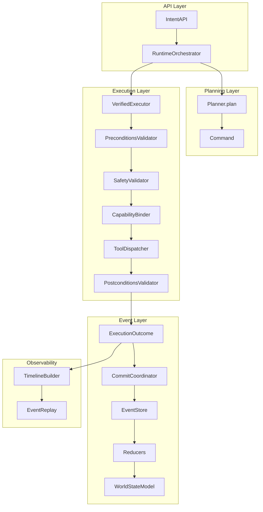
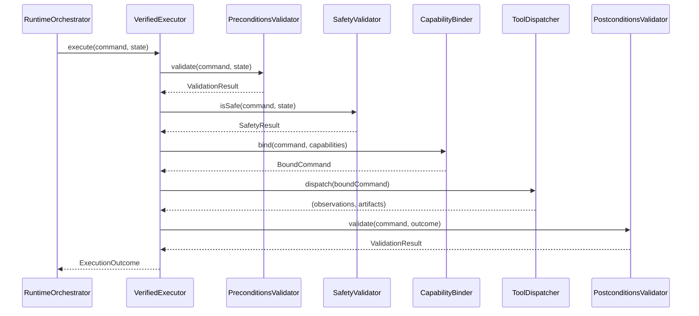
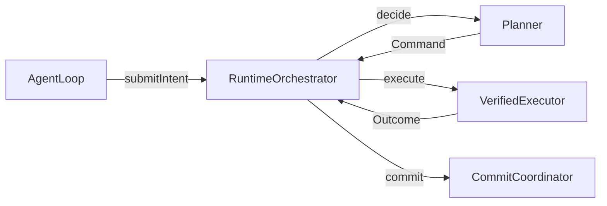

# Oracle-OS Runtime Hardening Technical Specification

## Executive Summary

This document outlines the technical specification for implementing a 10-phase runtime hardening plan plus additional architectural layers for Oracle OS. The hardening effort ensures a single execution truth path: `intent → target resolution → policy check → verified execution → transition recording → graph/memory update`.

## Table of Contents

1. [Architecture Overview](#architecture-overview)
2. [Phase 1: RuntimeOrchestrator Hardening](#phase-1-runtimeorchestrator-hardening)
3. [Phase 2: Execution Bypass Elimination](#phase-2-execution-bypass-elimination)
4. [Phase 3: VerifiedActionExecutor Enforcement](#phase-3-verifiedactionexecutor-enforcement)
5. [Phase 4: Planner Consolidation](#phase-4-planner-consolidation)
6. [Phase 5: AgentLoop Simplification](#phase-5-agentloop-simplification)
7. [Phase 6: Event Sourcing Strengthening](#phase-6-event-sourcing-strengthening)
8. [Phase 7: Action System Refactoring](#phase-7-action-system-refactoring)
9. [Phase 8: Controller Boundary Hardening](#phase-8-controller-boundary-hardening)
10. [Phase 9: Governance Testing](#phase-9-governance-testing)
11. [Phase 10: Migration Layer Removal](#phase-10-migration-layer-removal)
12. [Additional Layers](#additional-layers)
13. [Implementation Roadmap](#implementation-roadmap)
14. [Risk Mitigation](#risk-mitigation)

---

## Architecture Overview

### Core Execution Spine



### Key Invariants

| Rule | Description | Enforcement |
|------|-------------|-------------|
| **Execution Boundary** | Only VerifiedExecutor may produce side effects | ExecutionBoundaryTests |
| **State Boundary** | Reducers are the only state writers | StateMutationTests |
| **Planner Boundary** | Planners return Commands only | PlannerBoundaryTests |
| **Controller Boundary** | Controller uses IntentAPI only | ControllerBoundaryTests |
| **Event Ancestry** | Every committed change has event ancestry | EventHistoryInvariantTests |
| **Replayability** | Runtime cycles are replayable | EventReplayTests |

---

## Phase 1: RuntimeOrchestrator Hardening

### Objective

Strengthen RuntimeOrchestrator as the single authoritative coordinator, removing duplicate execution logic and ensuring clean delegation to VerifiedExecutor.

### Components to Modify

| File | Action |
|------|--------|
| [`RuntimeOrchestrator.swift`](Sources/OracleOS/Runtime/RuntimeOrchestrator.swift) | Remove duplicate pipeline; delegate to VerifiedExecutor |
| [`VerifiedExecutor.swift`](Sources/OracleOS/Execution/VerifiedExecutor.swift) | Ensure complete pipeline implementation |

### Current State Issues

- RuntimeOrchestrator.execute() contains full preconditions → safety → capability → dispatch → postconditions pipeline
- Duplicates VerifiedExecutor.execute() logic
- Contains legacy context property (`_legacyContext`)

### Implementation Approach

```swift
// Target: RuntimeOrchestrator.swift - Simplified execute method
public func execute(_ command: any Command, state: WorldStateModel) async throws -> ExecutionOutcome {
    // Delegate full validation + dispatch pipeline to VerifiedExecutor
    let outcome = try await verifiedExecutor.execute(command, state: state)
    
    // Build event envelopes from outcome
    let events = buildEvents(from: command, observations: outcome.observations, 
                             artifacts: outcome.artifacts, status: outcome.status)
    
    return ExecutionOutcome(
        commandID: outcome.commandID,
        status: outcome.status,
        observations: outcome.observations,
        artifacts: outcome.artifacts,
        events: events,
        verifierReport: outcome.verifierReport
    )
}
```

### Dependencies

- Requires VerifiedExecutor to have complete pipeline
- Event building logic must be preserved

### Acceptance Criteria

- [ ] RuntimeOrchestrator.execute() contains no direct validator/dispatcher calls
- [ ] Legacy `_legacyContext` property removed
- [ ] All execution flows through VerifiedExecutor

---

## Phase 2: Execution Bypass Elimination

### Objective

Remove all alternate execution paths that bypass VerifiedExecutor, particularly CodeActionGateway and RuntimeExecutionDriver direct calls.

### Components to Modify/Create

| File | Action |
|------|--------|
| [`CodeActionGateway.swift`](Sources/OracleOS/Runtime/CodeActionGateway.swift) | Deprecate or migrate logic to ToolDispatcher |
| [`RuntimeExecutionDriver.swift`](Sources/OracleOS/Runtime/RuntimeExecutionDriver.swift) | Convert to intent translator |

### Current Bypass Paths

1. **CodeActionGateway**: Direct filesystem/process execution outside VerifiedExecutor
2. **RuntimeExecutionDriver**: Calls `runtime.performAction()` directly
3. Legacy ActionIntent handling

### Implementation Approach

```swift
// Target: RuntimeExecutionDriver.swift - Convert to intent translator
public func execute(intent: ActionIntent, ...) -> ToolResult {
    // Convert ActionIntent to Intent
    let osIntent = Intent(objective: intent.name, domain: .os)
    
    // Submit through IntentAPI (not direct execution)
    let response = try await runtime.submitIntent(osIntent)
    
    return ToolResult(success: response.outcome == .success)
}
```

### Dependencies

- Phase 1 must complete first (VerifiedExecutor must be complete)
- ToolDispatcher must handle all command kinds

### Acceptance Criteria

- [ ] No file outside Execution/ToolDispatcher.swift directly executes filesystem/process commands
- [ ] RuntimeExecutionDriver uses IntentAPI only
- [ ] CodeActionGateway deprecated or removed

---

## Phase 3: VerifiedActionExecutor Enforcement

### Objective

Ensure VerifiedExecutor is the ONLY layer allowed to produce side effects, with complete validation pipeline.

### Components to Verify

| File | Status |
|------|--------|
| [`PreconditionsValidator.swift`](Sources/OracleOS/Execution/PreconditionsValidator.swift) | Must validate before execution |
| [`SafetyValidator.swift`](Sources/OracleOS/Execution/SafetyValidator.swift) | Must check dangerous patterns |
| [`CapabilityBinder.swift`](Sources/OracleOS/Execution/CapabilityBinder.swift) | Must bind capabilities |
| [`ToolDispatcher.swift`](Sources/OracleOS/Execution/ToolDispatcher.swift) | Must be ONLY invocation point |
| [`PostconditionsValidator.swift`](Sources/OracleOS/Execution/PostconditionsValidator.swift) | Must validate after execution |

### Pipeline Contract



### Implementation Approach

1. Verify each validator has complete implementation
2. Ensure no bypass paths exist
3. Add comprehensive test coverage

### Dependencies

- Phase 2 must complete (no bypass paths)

### Acceptance Criteria

- [ ] VerifiedExecutor contains full pipeline
- [ ] ExecutionBoundaryTests pass
- [ ] No bypass paths exist

---

## Phase 4: Planner Consolidation

### Objective

Transform MainPlanner from god-object to route-only façade that delegates to specialized strategies.

### Components to Modify

| File | Action |
|------|--------|
| [`MainPlanner.swift`](Sources/OracleOS/Planning/MainPlanner.swift) | Extract to façade |
| [`Planning/Strategies/`](Sources/OracleOS/Planning/Strategies/) | Expand with extracted logic |
| [`PlanningContext.swift`](Sources/OracleOS/Runtime/PlanningContext.swift) | Move to Planning/ |

### Current MainPlanner Responsibilities (to extract)

- Task-graph navigation (→ GraphPathStrategy)
- Workflow retrieval (→ WorkflowStrategy)
- LLM-based reasoning (→ ReasoningStrategy)
- Ledger operations (→ LedgerStrategy)
- Plan scoring/ranking (→ PlanRanker)

### Implementation Approach

```swift
// Target: MainPlanner.swift - Simplified to route-only
public final class MainPlanner: @unchecked Sendable {
    private let strategySelector: StrategySelector
    private let planningContextBuilder: PlanningContextBuilder
    
    public func plan(intent: Intent, context: PlannerContext) async throws -> any Command {
        let planningContext = planningContextBuilder.build(from: context)
        let strategy = strategySelector.select(for: intent, context: planningContext)
        return try await strategy.execute(intent: intent, context: planningContext)
    }
}
```

### Dependencies

- Phase 3 must complete (VerifiedExecutor enforced)

### Acceptance Criteria

- [ ] MainPlanner does not import Execution/Actions
- [ ] Strategy files exist for each planning path
- [ ] PlannerBoundaryTests pass

---

## Phase 5: AgentLoop Simplification

### Objective

Narrow AgentLoop to orchestration-only, using RuntimeOrchestrator for all execution.

### Components to Modify

| File | Action |
|------|--------|
| [`AgentLoop.swift`](Sources/OracleOS/Execution/Loop/AgentLoop.swift) | Simplify to orchestrator wrapper |
| [`AgentLoop+Run.swift`](Sources/OracleOS/Execution/Loop/AgentLoop+Run.swift) | Rewrite to use orchestrator spine |

### Current AgentLoop Issues

- References MainPlanner, GraphStore, WorldStateModel directly
- Has multiple coordinators (execution, recovery, learning, experiment)
- Not using RuntimeOrchestrator as primary path

### Implementation Approach

```swift
// Target: AgentLoop.swift - Simplified init
public init(
    orchestrator: any IntentAPI,
    observationProvider: any ObservationProvider,
    ...
) {
    self.orchestrator = orchestrator
    // Remove direct coordinator initialization
}

// Target: Run loop
public func run(intent: Intent) async {
    let command = try await orchestrator.decide(intent: intent, planner: planner)
    let outcome = try await orchestrator.execute(command, state: worldState)
    try await orchestrator.commit(outcome)
    await orchestrator.evaluate(outcome)
}
```

### Data Flow



### Dependencies

- Phase 1, 4 must complete (RuntimeOrchestrator hardened, Planner simplified)

### Acceptance Criteria

- [ ] AgentLoop does not reference GraphStore, WorldStateModel directly
- [ ] AgentLoop does not call execution actions directly
- [ ] Uses RuntimeOrchestrator for all execution

---

## Phase 6: Event Sourcing Strengthening

### Objective

Ensure event sourcing is the ONLY state mutation path, with complete event history.

### Components to Modify

| File | Action |
|------|--------|
| [`EventStore.swift`](Sources/OracleOS/Events/EventStore.swift) | Ensure append-only |
| [`CommitCoordinator.swift`](Sources/OracleOS/Events/CommitCoordinator.swift) | Ensure single mutation gate |
| [`StateReducers/`](Sources/OracleOS/State/Reducers/) | Ensure pure derivation |

### Event Contract

| Event Type | Purpose |
|------------|---------|
| ActionStarted | Command execution begun |
| ActionCompleted | Command succeeded |
| ActionFailed | Command failed |
| ActionVerified | Post-execution validation passed |
| ArtifactProduced | File/artifact created |

### Implementation Approach

1. Verify EventStore.append() is the only write method
2. Ensure CommitCoordinator is single mutation gate
3. Verify reducers are pure functions

### Dependencies

- Phase 5 must complete (AgentLoop simplified)

### Acceptance Criteria

- [ ] StateMutationTests pass
- [ ] EventHistoryInvariantTests pass
- [ ] EventReplayTests pass

---

## Phase 7: Action System Refactoring

### Objective

Break monolithic Actions.swift into focused command modules.

### Components to Modify

| File | Action |
|------|--------|
| [`Commands/`](Sources/OracleOS/Commands/) | Create command type modules |
| [`Intent/Actions/Actions.swift`](Sources/OracleOS/Intent/Actions/Actions.swift) | Split or deprecate |

### Split Plan

| Component | Target |
|-----------|--------|
| Command schemas | Commands/UI/*.swift, Commands/Code/*.swift |
| Action handlers | Execution/Actions/*.swift |
| Artifact types | Execution/Artifacts/Artifact.swift |

### Dependencies

- Phase 6 must complete (event sourcing strengthened)

### Acceptance Criteria

- [ ] Actions.swift < 5KB or deleted
- [ ] All command types resolve from Commands/ module

---

## Phase 8: Controller Boundary Hardening

### Objective

Ensure Controller (OracleController) only interacts through IntentAPI, not internal APIs.

### Components to Modify

| File | Action |
|------|--------|
| [`ControllerRuntimeBridge.swift`](Sources/OracleControllerHost/ControllerRuntimeBridge.swift) | Audit and restrict |
| [`IntentAPI.swift`](Sources/OracleOS/API/IntentAPI.swift) | Ensure complete interface |

### Boundary Rules

- Controller may only call: submitIntent(), queryState()
- Controller may not access: RuntimeOrchestrator internals, VerifiedExecutor, EventStore directly

### Implementation Approach

```swift
// Target: ControllerRuntimeBridge.swift
// BEFORE: runtime.performAction(action)
// AFTER: runtime.submitIntent(intent)
```

### Dependencies

- Phase 7 must complete (action system refactored)

### Acceptance Criteria

- [ ] ControllerBoundaryTests pass
- [ ] No Controller imports outside OracleOS.API

---

## Phase 9: Governance Testing

### Objective

Implement comprehensive governance tests that enforce architectural boundaries.

### Components to Create/Modify

| File | Action |
|------|--------|
| [`ExecutionBoundaryTests.swift`](Tests/OracleOSTests/Governance/ExecutionBoundaryTests.swift) | Real assertions |
| [`StateMutationTests.swift`](Tests/OracleOSTests/Governance/StateMutationTests.swift) | Scan for banned patterns |
| [`LayerImportRulesTests.swift`](Tests/OracleOSTests/Governance/LayerImportRulesTests.swift) | Scan import statements |
| [`ControllerBoundaryTests.swift`](Tests/OracleOSTests/Governance/ControllerBoundaryTests.swift) | Verify IntentAPI only |
| [`EventHistoryInvariantTests.swift`](Tests/OracleOSTests/Governance/EventHistoryInvariantTests.swift) | Verify ancestry |

### Test Strategy

- Source code scanning for banned patterns
- Import statement verification
- Runtime behavior verification

### Dependencies

- All previous phases

### Acceptance Criteria

- [ ] All governance tests pass
- [ ] Introducing banned patterns causes failures

---

## Phase 10: Migration Layer Removal

### Objective

Remove legacy migration code and compatibility shims after hardening complete.

### Components to Remove

| File | Reason |
|------|--------|
| `Runtime/CodeActionGateway.swift` | Bypass - violates Rule 2 |
| `Runtime/_legacy*` properties | Migration complete |
| `LegacyCoordinator` classes | Replaced by RuntimeOrchestrator |

### Dependencies

- Phase 9 must complete (all governance tests pass)

### Acceptance Criteria

- [ ] No legacy migration code remains
- [ ] All tests pass

---

## Additional Layers

### Action Registry

**Purpose**: Central registry for all available actions with metadata.

**Components**:
- [`SkillRegistry.swift`](Sources/OracleOS/Skills/SkillRegistry.swift) - Existing
- NEW: ActionRegistry wrapper with governance metadata

**Interface**:
```swift
public protocol ActionRegistry: Sendable {
    func action(for kind: String) -> any ActionMetadata
    func allActions() -> [ActionMetadata]
    func validateCapability(_ capability: String, for action: String) -> Bool
}
```

### Policy Engine

**Purpose**: Centralized policy decision making.

**Components**:
- [`SafetyPolicy.swift`](Sources/OracleOS/Policy/SafetyPolicy.swift) - Existing stub
- [`CapabilityPolicy.swift`](Sources/OracleOS/Policy/CapabilityPolicy.swift) - Existing stub
- NEW: UnifiedPolicyEngine

**Interface**:
```swift
public protocol PolicyEngine: Sendable {
    func evaluate(command: any Command, state: WorldStateModel) async -> PolicyDecision
    func checkCapability(_ capability: String) -> Bool
}
```

### Event Schema

**Purpose**: Typed, versioned event definitions.

**Components**:
- [`EventEnvelope.swift`](Sources/OracleOS/Events/EventEnvelope.swift) - Existing
- NEW: Typed event definitions per domain

**Schema Categories**:
- ActionEvents (ActionStarted, ActionCompleted, ActionFailed, ActionVerified)
- PlanningEvents (CommandIssued, PlanCommitted)
- LearningEvents (MemoryCandidateCreated, MemoryPromoted)
- ArtifactEvents (ArtifactProduced)

### Persistent Storage

**Purpose**: Durable event storage and state snapshots.

**Components**:
- [`EventStore.swift`](Sources/OracleOS/Events/EventStore.swift) - In-memory, needs persistence
- NEW: PersistentEventStore adapter

**Interface**:
```swift
public protocol PersistentEventStore: Sendable {
    func append(_ events: [EventEnvelope]) async throws
    func events(from: Int, limit: Int) async throws -> [EventEnvelope]
    func latestSequenceNumber() async -> Int
}
```

### Safety

**Purpose**: Runtime safety guarantees.

**Components**:
- [`SafetyValidator.swift`](Sources/OracleOS/Execution/SafetyValidator.swift) - Expand
- NEW: SafetyPolicy enforcement layer

### Capability Sandboxing

**Purpose**: Limit action capabilities based on context.

**Components**:
- [`CapabilityBinder.swift`](Sources/OracleOS/Execution/CapabilityBinder.swift) - Expand
- NEW: SandboxPolicy

### Learning

**Purpose**: Experience accumulation and pattern discovery.

**Components**:
- [`Learning/`](Sources/OracleOS/Learning/) - Existing modules
- NEW: UnifiedLearningCoordinator

### Multi-agent

**Purpose**: Coordination between multiple agents.

**Components**:
- NEW: AgentCoordinator
- NEW: AgentCommunicationProtocol

### Controller UI

**Purpose**: User-facing controller interface.

**Components**:
- [`OracleController/`](Sources/OracleController/) - Existing
- NEW: Diagnostics UI

---

## Implementation Roadmap

### Wave 1: Runtime Truth

| Step | Task | Dependencies |
|------|------|--------------|
| 1.1 | Fix build compilation | - |
| 1.2 | Wire RuntimeOrchestrator → VerifiedExecutor | 1.1 |
| 1.3 | Narrow AgentLoop to new spine | 1.2 |
| 1.4 | Convert RuntimeExecutionDriver to intent translator | 1.3 |
| 1.5 | Deprecate CodeActionGateway | 1.4 |
| 1.6 | Implement ToolDispatcher handlers | 1.5 |

### Wave 2: Authority Cleanup

| Step | Task | Dependencies |
|------|------|--------------|
| 2.1 | MainPlanner → route-only façade | 1.6 |
| 2.2 | Narrow DecisionCoordinator | 2.1 |
| 2.3 | Narrow ExecutionCoordinator | 2.1 |
| 2.4 | Audit Controller boundary | 2.3 |
| 2.5-2.8 | Real governance tests | 2.4 |

### Wave 3: Domain Capability Cleanup

| Step | Task | Dependencies |
|------|------|--------------|
| 3A | Split Actions.swift | 2.8 |
| 3B | Wire AXScanner split | 3A |
| 3C | Wire RepositoryIndexer split | 3A |
| 3D | Unify memory | 3A, 3B |

### Wave 4: Operator Quality

| Step | Task | Dependencies |
|------|------|--------------|
| 4A | Observability implementation | 3D |
| 4B | Replay test | 4A |
| 4C | Dependencies pinning | 4B |
| 4D | Documentation refresh | 4C |
| 4E | Concurrency audit | 4D |

---

## Risk Mitigation

### Technical Risks

| Risk | Likelihood | Impact | Mitigation |
|------|------------|--------|------------|
| VerifiedExecutor incomplete | High | Critical | Implement complete pipeline first |
| Bypass paths remain | High | Critical | Comprehensive boundary tests |
| AgentLoop migration breaks functionality | Medium | High | Incremental changes, extensive testing |
| MainPlanner extraction breaks planning | Medium | High | Strategy pattern ensures backward compatibility |

### Process Risks

| Risk | Likelihood | Impact | Mitigation |
|------|------------|--------|------------|
| Scope creep | Medium | Medium | Strict phase gates |
| Test coverage gaps | High | Medium | Governance tests first |
| Dependency conflicts | Low | Medium | Pin dependencies early |

### Mitigation Strategies

1. **Phase Gates**: Each phase requires test pass before proceeding
2. **Incremental Changes**: Small, verifiable changes
3. **Rollback Plans**: Keep legacy code until new path verified
4. **Parallel Testing**: Old and new paths tested simultaneously during transition

---

## Conclusion

This technical specification provides a comprehensive blueprint for Oracle OS runtime hardening. The 10-phase approach ensures systematic elimination of bypass paths while maintaining system functionality throughout the migration.

The key success factors are:
- Single execution truth path enforced through VerifiedExecutor
- Comprehensive governance tests prevent regression
- Incremental phase approach minimizes risk
- Additional layers provide extensibility and safety

